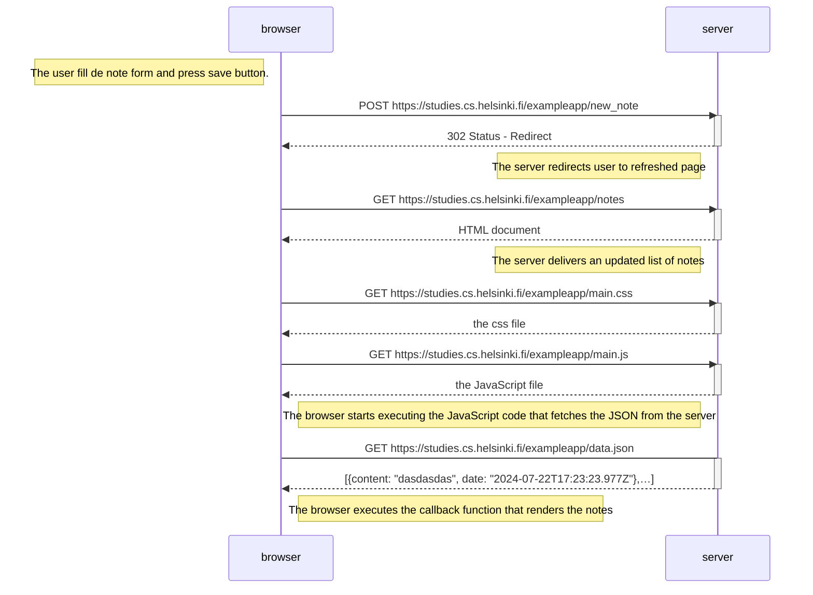

```mermaid

sequenceDiagram
    participant browser
    participant server

    Note left of browser: The user fill de note form and press save button.

    browser->>server: POST https://studies.cs.helsinki.fi/exampleapp/new_note
    activate server
    server-->>browser: 302 Status - Redirect
    deactivate server

    Note left of server: The server redirects user to refreshed page


    browser->>server: GET https://studies.cs.helsinki.fi/exampleapp/notes
    activate server
    server-->>browser: HTML document
    deactivate server
    
    Note left of server: The server delivers an updated list of notes

    browser->>server: GET https://studies.cs.helsinki.fi/exampleapp/main.css
    activate server
    server-->>browser: the css file
    deactivate server

    browser->>server: GET https://studies.cs.helsinki.fi/exampleapp/main.js
    activate server
    server-->>browser: the JavaScript file
    deactivate server

    Note right of browser: The browser starts executing the JavaScript code that fetches the JSON from the server

    browser->server: GET https://studies.cs.helsinki.fi/exampleapp/data.json
    activate server
    server-->>browser: [{content: "dasdasdas", date: "2024-07-22T17:23:23.977Z"},…]
    deactivate server

    Note right of browser: The browser executes the callback function that renders the notes

```