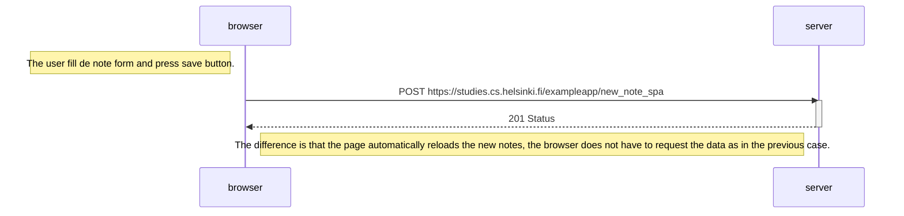

```mermaid

sequenceDiagram
    participant browser
    participant server

    Note left of browser: The user fill de note form and press save button.

    browser->>server: POST https://studies.cs.helsinki.fi/exampleapp/new_note_spa
    activate server
    server-->>browser: 201 Status
    deactivate server

    
    Note left of server: The difference is that the page automatically reloads the new notes, the browser does not have to request the data as in the previous case.

```